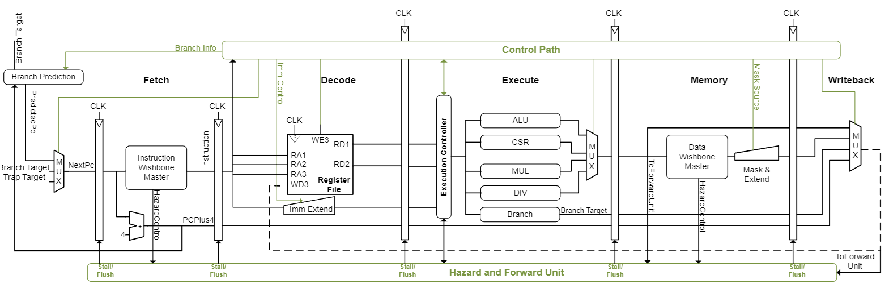
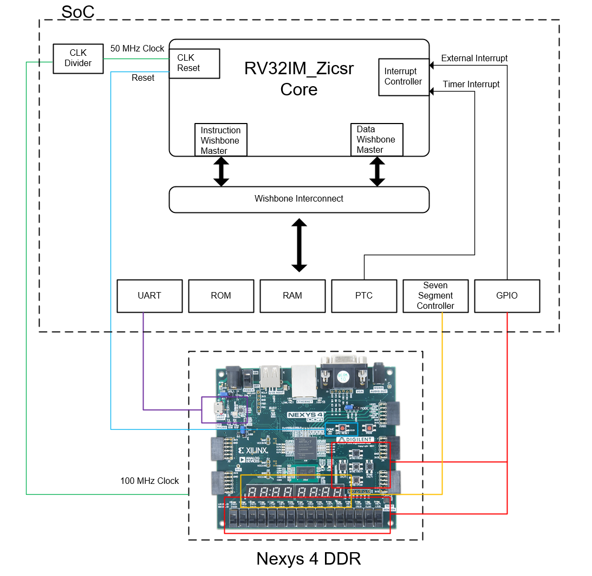
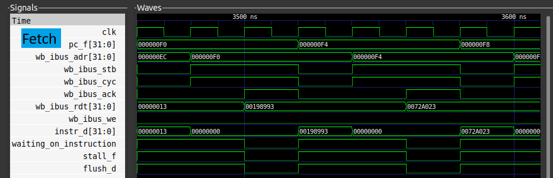
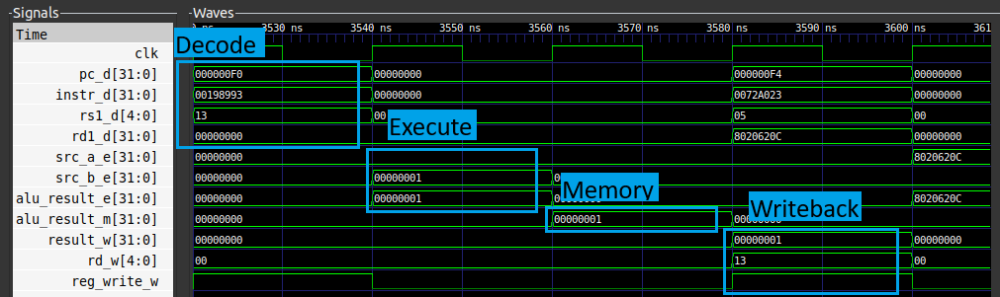
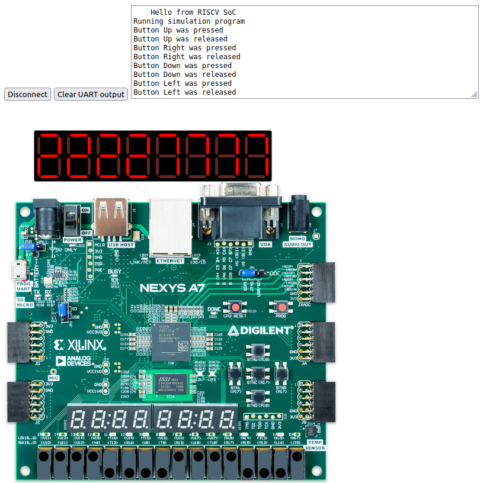

# RISC-V Processor
The processor in compliance with the open RISC-V standard is designed using the hardware description language – `VHDL`. The focus was on addressing the challenge of verifying the correctness and functionality of the designed RISC-V processor through `simulation` and `testing`, ensuring that it meets RISC-V – `RV32IMZicsr` specifications and architectural requirements.

# Pipelining
The processor designed has the classical pipeline implementation of five stages, with the unit for data forwarding, simple dynamic branch prediction, the handling of precise exceptions and interrupts, as well as the Wishbone interface for data and instructions.

[](https://opensource.org/licenses/BSD-3-Clause)


# System on Chip
The processor has been integrated into a SoC architecture to include embedded peripherals and experiment with various functionalities. The goal is to explore the interaction between the processor and its peripherals.
This integration provides a platform to experiment with processor and peripheral interactions, such as handling Interrupts, Programmed I/O, and peripheral control.

[](https://opensource.org/licenses/BSD-3-Clause)


The wishbone interconnect has been autogenerated using [Wishbone interconnect utilities](https://github.com/olofk/wb_intercon).
# Simulation
For simulation [Verilator](https://github.com/verilator/verilator) has been used for different reasons like:
* Easier to write testbenches in C++.
* Easier to integrate third party libraries like [vidbo](https://github.com/olofk/vidbo).
* Open-Source.
* Known for its speed of simulation.

The goal of `user simulation` is to interact with the virtual board the same as we would with the physical board. Since the processor is designed in VHDL and Verilator supports `Verilog`, we used [GHDL](https://github.com/ghdl/ghdl) where the VHDL source code gets translated to a module Verilog netlist.

## Vidbo
Vidbo uses websockets to handle the input and output, in our case the web browser handles the user interactions and over websockets that information is sent to the `C++` code in Verilator that simulates the chip.

The `example` provided in `Vidbo` was used and modified for our use cases.

## GTKWave
[GTKWave](https://github.com/gtkwave/gtkwave) was used during debuggingg, when something was not working as it should, GTKWave made it possible to view the waveforms of the signals and find in which digital logic block the issue was.

Code:
```
e8: 00000993    li s3, 0

000000ec <count_loop>:
ec: 01342023    sw s3,0(s0)
f0: 00198993    add s3,s3,1
f4: 0072a023    sw t2,0(t0)
f8: 01c2a023    sw t3,0(t0)
```



## How to run the software examples

The software examples are located at `sw/examples/`, to run lets say `led_example`

* First step
```
$ cd sw/examples/led_example
$ make
```
This step converts the C code to RISC-V machine code. And autogenerates a VHDL memory file, that will be used to initialzie the ROM of the SoC.
* Second step
```
$ cd vidbo
$ make clean && make -j12
```
This step runs Verilator, which performs a cycle-accurate simulation of the hardware we have described. It compiles the digital design into C++ code, allowing us to simulate the behavior of the hardware alongside the software.
* Third step
```
$ ./Vrvsocsim
```
* Fourth step
```
$ python -m http.server --directory nexys-board
Serving HTTP on 0.0.0.0 port 8000 (http://0.0.0.0:8000/) ...
```
The fourth step starts the `http` server, with the resources in directory nexys-board, then opening the URL in any browser, we can interact with the virtual Nexys board.



# Implementation in FPGA Artix-7
It has been implemented in a `Nexys4 DDR FPGA` with a maximum operating frequency of `50 MHz`.
In Vivado import the project using the `tcl` file located in `rtl/vivado/nexys4_ddr`.

Vivado can be used to generate the bitstream and program Nexys4 DDR. To run the software examples in Nexys4, follow the first two steps as with simulation, then in Vivado simply `run` the project.

# Verification of the core using RISCOF
RISCOF is used in order to test the RISC-V Processor for compatibility to the RISC-V user and privileged ISA specifications. In `riscv-target` directory is the implementation needed to run the [RISC-V Architecture Test SIG](https://github.com/riscv-non-isa/riscv-arch-test), the comparison of the signatures for the core designed is done in reference to [RISCV Sail Model](https://github.com/riscv/sail-riscv).

# Hardware Utilization of the Processor Core in Nexys4 DDR

| Resource      | Utilization   | Available   | Utilization % |
| ------------- | ------------- | ------------- | ------------- |
| LUT     | 2545   | 63400   | 4.01   |
| LUTRAM  | 172   | 19000   | 0.91   |
| FF  | 1419   | 126800   | 1.12   |
| DSP  | 8   | 240   | 3.33   |
| IO  | 175   | 210   | 83.33   |

# CoreMark
In the software examples, you can find the [CoreMark](https://github.com/eembc/coremark) benchmark, which when run using `dp_rom` and compiler optimization flags, the result was `0.9 CM/MHz`.

